## About Me

- 🎓 MS Computer Science student at Stevens Institute of Technology (GPA 3.702, expected May 2027), and B.E. Computer Engineering from RGIT Mumbai (9.360 CGPA ~ 3.91 GPA)
- 🧠 Focused on agentic AI engineering: LangGraph pipelines, multi-agent orchestration, RAG architectures, and FastAPI backends deployed on GCP Cloud Run, Railway, and Streamlit Cloud
- 🏆 1st place at GDG NYC Hackathon 2026 (DroneWatch), 1st place at Quack Hacks 2026 (ClaimCrane, Chubb-sponsored), 1st place at SPY Hackathon (ClassCast)
- 💼 Spent 2 years as a Workforce Management Analyst at Reliance Jio building SQL ETL pipelines and Tableau/Power BI dashboards before moving fully into AI engineering
- 🌱 Currently building SkinOS, an AI-powered skincare platform for melanin-rich and brown skin
- 🎯 Looking for AI/ML internships and co-ops (Summer 2026, Spring 2027, Fall 2027) and developing a research statement on agentic AI and long-horizon reasoning for PhD applications
- 📫 Reach me at bmaurya@stevens.edu

## Connect With Me

## Tech Stack

**Languages**

**Agentic AI & LLM Frameworks**

**ML / Deep Learning**

**Data & Vector Stores**

**Backend & Deployment**

**Analytics**

## Featured Work

| Project | Highlights | Stack |
|---|---|---|
| **ClaimCrane** | 1st place, Quack Hacks 2026 (Chubb-sponsored). Dual-layer fraud detection hitting 90% accuracy across 5 insurance verticals with 5 CV detectors plus Gemini Gemma 3 27B | React, FastAPI, Gemini, Computer Vision |
| **ClassCast** | 1st place, SPY Hackathon. Real-time AI lecture transcription and animation broadcast system that turns a live lecture feed into transcribed, animated visuals through an 8-node LangGraph pipeline | LangGraph, ChromaDB, Sentence-BERT |
| **SpecForge** | Agentic spec-to-architecture tool that takes a written requirements doc and turns it into a structured system architecture, with persistent versioning so specs can evolve over multiple sessions | LangGraph, FastAPI, React, SQLite |
| **CloudDash** | Multi-agent support assistant with RAG-grounded responses and intent-based escalation routing, built and deployed end to end as part of an AI Engineer Intern technical assessment | LangGraph, RAG, Railway, Streamlit |
| **Agentic Insider Signal Detection Engine** | 8-node LangGraph pipeline combining PELT change detection and Beta-Binomial Bayesian modeling for insider trading signal analysis | LangGraph, ChromaDB, Gemma |
| **TalentLens** | RAG-based candidate intelligence platform for recruiting workflows | FastAPI, LangChain, LangGraph, FAISS/Pinecone |

*(Pin cards only render for public repos GitHub recognizes by exact name. Once these are pushed publicly, send me the repo names and I will swap them in the same way as DroneWatch above.)*

## GitHub Stats

